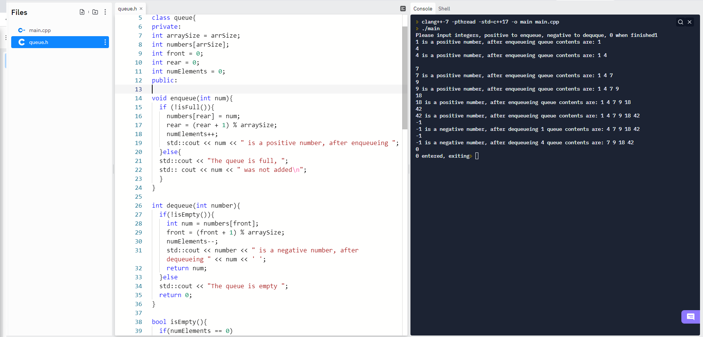

# Data Structures 3
## Assignment 3 for Data Structures as Northeastern State University
 
#### The program gets user input through the console, which effects the contents of a queue.
 
A queue class is the main part of this program. The queue class included two main functions, enqueue, and dequeue. The program starte by declaring an instance of the queue class. The user in propmted for input. If the user input is positive, enqueue is called and the input is added to the queue. If the input is negative dequeue is called, and the first item that was added to the queue is removed. If 0 is entered the program closes.

#### Queue class structure
```
class queue{
private:
int arraySize = arrSize;
int numbers[arrSize];
int front = 0;
int rear = 0;
int numElements = 0;
```

### Example of program running and input being given
